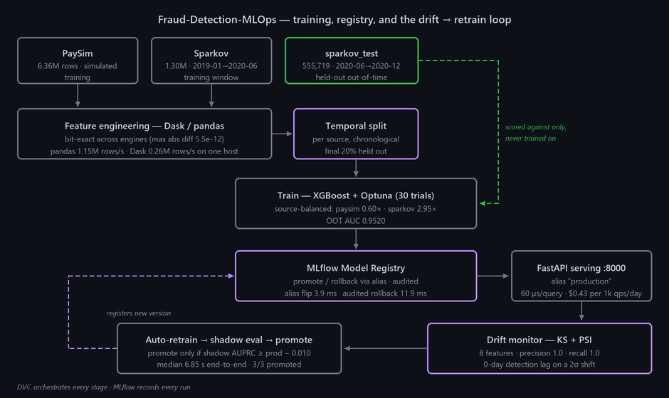

> 🔗 **Live demo:** https://iambatman07-fraud-detection-mlops.hf.space · [HF Space](https://huggingface.co/spaces/IamBatman07/Fraud-Detection-MLOps)

# Fraud-Detection-MLOps

A fraud-detection system for payment transactions, built as a full MLOps pipeline rather than a notebook. It trains an XGBoost classifier on 6.1M transactions from two sources (PaySim and Sparkov), serves it behind a FastAPI endpoint, and keeps it healthy in production: a drift monitor watches eight features, and when the data shifts the system retrains, evaluates the candidate in shadow mode, and promotes it only if it beats the model currently live. Every model version is registered in MLflow and can be rolled back in milliseconds.

The point of the project is the operational layer — the split discipline, the registry, the drift loop — not the classifier itself.

---

## Architecture



---

## Measured results

All numbers below are read from committed artifacts in `results/`. Evaluation is on `sparkov_test.csv` — 555,719 transactions from a later time window that never enters training.

### The split fixes the score

The original training code used a random split on time-series data, which leaked future transactions into training. Fixing it to a per-source chronological split moved the number:

| Split | OOT AUC | |
|---|---:|---|
| Random stratified (as originally written) | 0.9210 | inflated by leakage |
| **Per-source temporal (final 20% held out)** | **0.7949** | honest baseline |

Source: [`results/baseline_metrics.json`](results/baseline_metrics.json)

### Tuning closes the gap to AutoGluon

| Model | OOT AUC | Δ vs AutoGluon |
|---|---:|---:|
| AutoGluon (published FDB baseline) | 0.9520 | — |
| **XGBoost + Optuna + source-balanced weights** | **0.95196** | **−0.00004** |

Source: [`results/day05/day05_leaderboard.csv`](results/day05/day05_leaderboard.csv) · weights: paysim 0.60×, sparkov 2.95×

### Each discipline layer is load-bearing

| Layer | OOT AUC | Δ |
|---|---:|---:|
| L0 — random split, XGBoost defaults | 0.5467 | — |
| L1 — + temporal split | 0.6574 | +0.1108 |
| L2 — + source-balanced weights | 0.6962 | +0.0388 |
| L3 — + Optuna tuning | **0.9480** | **+0.2518** |

**Total L0 → L3: +0.4013 AUC.** Source: [`results/day06/ablation_modelling.csv`](results/day06/ablation_modelling.csv)

### Specialised model vs a frontier LLM

Same 200-row out-of-time sample, scored three ways:

| Strategy | AUC | AUPRC | Latency/query | Cost @ 1k qps/day |
|---|---:|---:|---:|---:|
| **XGBoost champion** | **0.9156** | **0.5260** | 60 µs | **$0.43** |
| Naive notebook XGBoost | 0.6264 | 0.4153 | 73 µs | $0.43 |
| Claude Opus 4.6 as judge | 0.6225 | 0.3512 | 1.82 s | $1,250,691 |

The LLM is 30,400× slower and 2.9M× more expensive at equal throughput, and ranks worse than the tuned model. The naive XGBoost effectively ties the LLM — the 0.29 AUC gap comes from the discipline layers above, not from the algorithm. Source: [`results/day06/frontier_comparison.csv`](results/day06/frontier_comparison.csv)

### Operational metrics

| Capability | Measured | Source |
|---|---|---|
| Registry rollback | **3.9 ms** median alias flip · 11.9 ms fully audited | [`registry_rollback_times.csv`](results/registry_rollback_times.csv) |
| Drift detection | **precision 1.0, recall 1.0, 0-day lag** on a 2σ shift injected at day 23 of a 30-day replay | [`drift_replay_summary.json`](results/drift_replay_summary.json) |
| Auto-retrain | **median 6.85 s** detect → train → shadow-eval → promote · 3/3 events promoted | [`drift_retrain_events.csv`](results/drift_retrain_events.csv) |
| Dask vs pandas | bit-exact to **5.5e-12**; pandas 1.15M rows/s vs Dask 0.26M rows/s on one host | [`throughput_speedup.csv`](results/throughput_speedup.csv) |

Dask is slower on a single host by design — it is the scaling primitive, and being bit-exact with pandas is what lets you swap engines without changing results.

---

## How it works

1. **Ingest** — PaySim and Sparkov are pulled through a DVC pipeline so every stage is reproducible from a clean checkout.
2. **Features** — engineered identically in pandas or Dask; a determinism test asserts the two agree to within 5.5e-12.
3. **Split** — each source is sorted chronologically and the final 20% held out. A regression test fails if a random split reappears.
4. **Train** — XGBoost with source-balanced sample weights, tuned by a 30-trial Optuna sweep. Every run is logged to MLflow.
5. **Register** — the winning run is registered and promoted by moving the `production` alias. Rollback is the same operation in reverse, and both write an audit tag.
6. **Serve** — FastAPI resolves the `production` alias at startup and scores in ~60 µs.
7. **Monitor** — KS and PSI run over eight features per day. Two consecutive drift days trigger a retrain.
8. **Retrain → shadow → promote** — the candidate is scored on held-out data and promoted only if its AUPRC is within tolerance of the live model. If it loses, the live model stays.

## Infrastructure

| Layer | Technology |
|---|---|
| Pipeline | DVC |
| Training | XGBoost · Optuna |
| Tracking / registry | MLflow (SQLite locally, Postgres in compose) |
| Feature engineering | pandas · Dask |
| Serving | FastAPI · Uvicorn |
| Dashboard | Streamlit |
| Store / cache | Postgres · Redis |
| Packaging | Docker Compose |
| CI | GitHub Actions |

---

## Quick start

```bash
# Full stack: Postgres + MLflow + Redis (+ FastAPI serving profile)
docker compose up -d
docker compose --profile serving up -d api      # FastAPI on :8000
mlflow ui                                        # MLflow UI on :5000

# Streamlit ops dashboard — navigate to the "4 Ops" page
streamlit run app.py

# DVC pipeline
dvc repro                                        # full pipeline
dvc repro train                                  # train stage only

# MLOps operations
python -m src.registry.promote  --experiment sentinel-day01-temporal-split --alias production
python -m src.registry.rollback --target-version 1
python -m src.features.benchmark --sizes 100000 500000 1000000

# Demo script
bash scripts/demo.sh

# Tests
pytest tests/ -q
pytest tests/ -q -m "not requires_data"          # CI mode (skips full-data replay)
```

Regenerate the architecture diagram with `python assets/make_architecture.py`.

---

## Datasets

| Dataset | Rows | Window | Use |
|---|---:|---|---|
| `paysim.csv` | 6.36M | step-based sim | training |
| `sparkov.csv` | 1.30M | 2019-01 → 2020-06 | training window |
| `sparkov_test.csv` | 555,719 | 2020-06 → 2020-12 | held-out out-of-time |

DVC-tracked; `dvc pull` to materialize.

---

## License

MIT. See [LICENSE](LICENSE).
