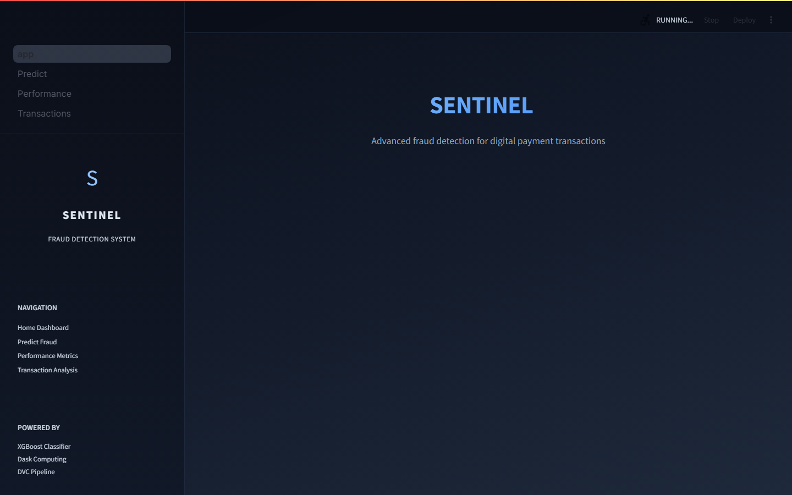
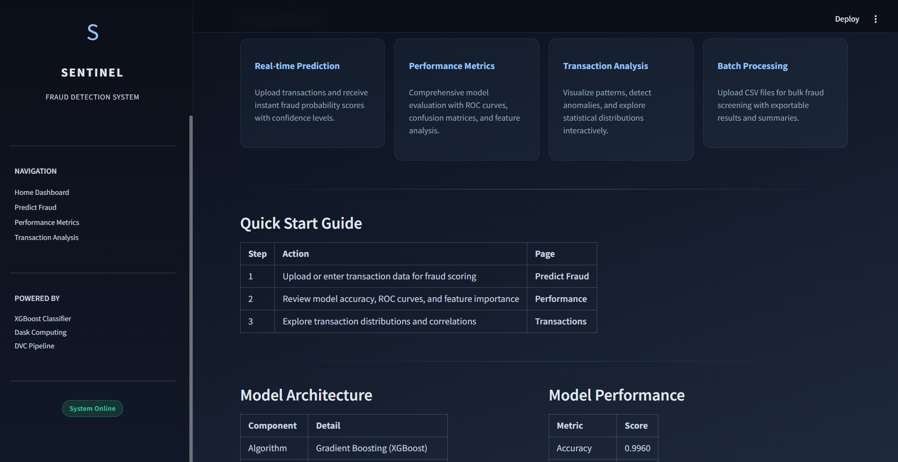
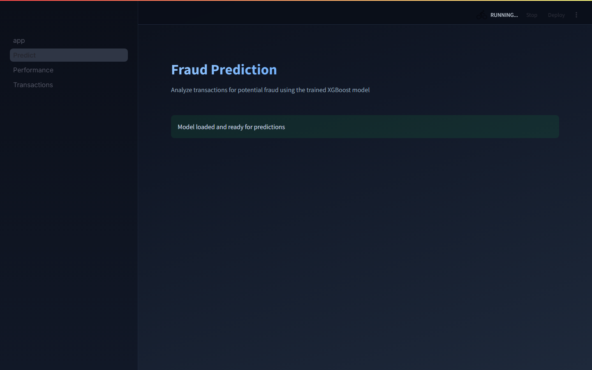
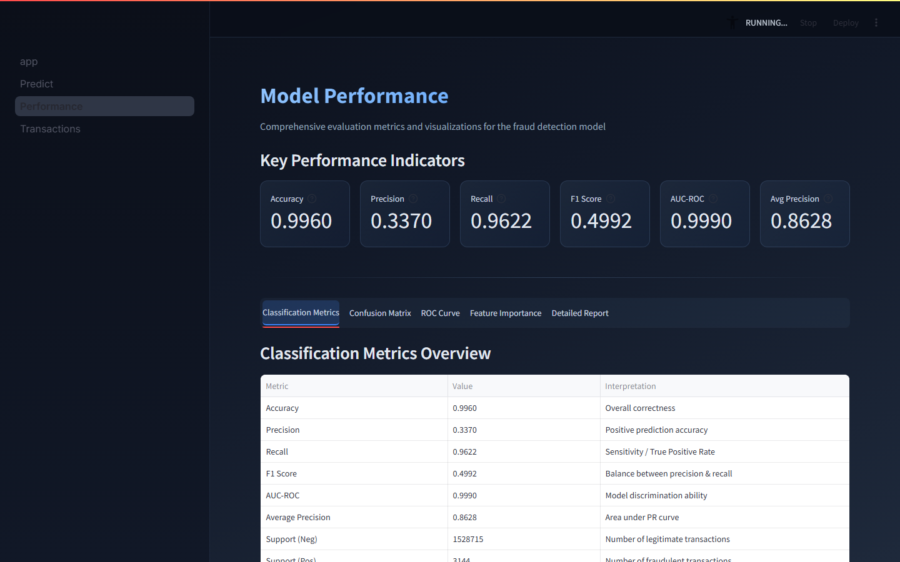
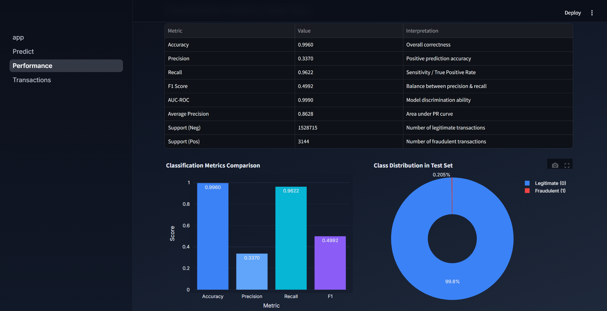
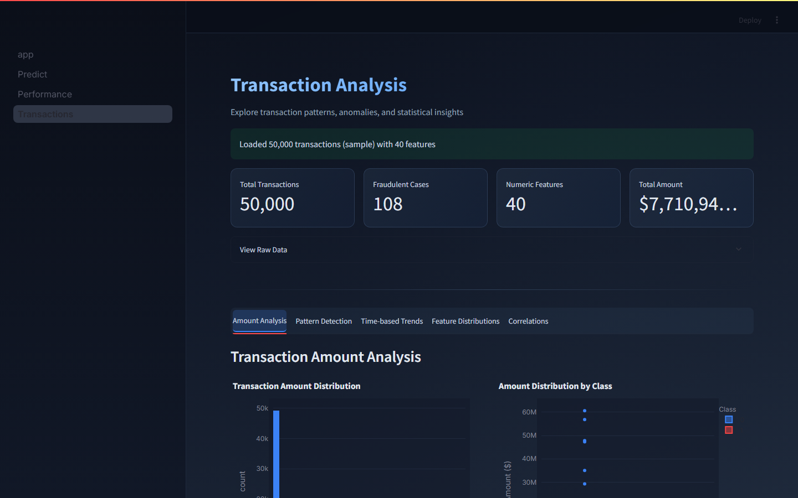
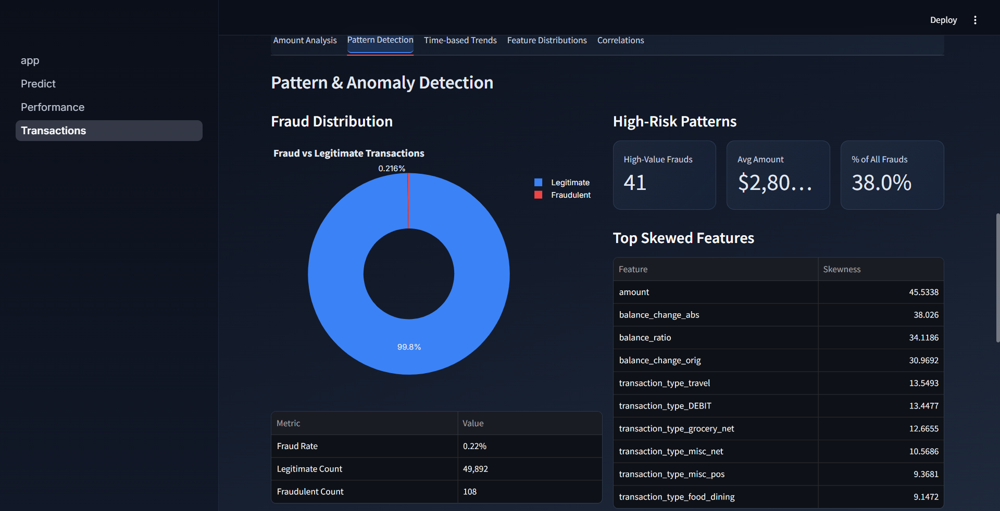

# SENTINEL Fraud Detection

End-to-end fraud detection project for payment transactions with:
- reproducible ML pipelines using DVC
- XGBoost model training and evaluation with MLflow tracking + registry
- optional Amazon Fraud Dataset Benchmark (FDB) integration
- distributed (Dask) and single-node (Pandas) behavioral feature engineering, bit-exact between backends
- multi-page Streamlit dashboard for prediction and analytics

## 21-Day Production MLOps Upgrade Sprint (May 18 -- May 24, 2026)

The current honest sparkov AUC is **0.7949**, not the pre-fix 0.921 that early commits reported. The 0.921 number was inflated by two stacked leakage paths in the Day-1 audit; replacing them with a per-source temporal split and a held-out test file dropped the score by ~13pp. The story of the sprint *is* that fix.

### Day 1 (2026-05-18) -- Audit + temporal-split fix + MLflow baseline

- **Audit:** `docs/MLOPS_AUDIT.md` documents the pre-fix pipeline.
- **Leakage path 1:** `src/train.py` previously used `train_test_split(stratify=y)` -- a random split. Fraud transactions are temporal; a random split leaks future patterns into training. Fixed by `temporal_split_per_source` (sort each source by `txn_timestamp`, take the last `test_size` fraction as test). See `docs/DATA_SPLIT.md`.
- **Leakage path 2:** `src/benchmark_fdb.py` fell back to `data/raw/sparkov.csv` -- the same file used for training. Fixed by preferring the held-out `data/raw/sparkov_test.csv` (Jun-Dec 2020, never seen in training).
- **MLflow:** every training run is now wrapped in `mlflow.start_run()` against a local sqlite store (`sqlite:///mlflow.db`). Params, metrics, the XGBoost artifact, and the joblib model file are all logged. See `results/baseline_metrics.json` for the full audit trail.

| Metric                                    | Pre-fix (leaked) | Post-fix (honest) | Delta    |
|-------------------------------------------|-----------------:|------------------:|---------:|
| Sparkov benchmark AUC                     | 0.9210           | 0.7949            | -0.126   |
| Delta vs AutoGluon 0.952                  | -0.031           | -0.157            | -0.126   |
| Combined-test AUC (in-distribution slice) | n/a              | 0.9989            | --       |
| Combined-test AP (in-distribution slice)  | n/a              | 0.8280            | --       |

The held-out 0.7949 is the project's honest number against AutoML baselines. The 0.999 combined-test AUC is the in-distribution slice (paysim dominates with its near-deterministic balance signal), reported for completeness.

### Day 2 (2026-05-19) -- Distributed feature engineering + MLflow registry rollback bench

- **`src/features/engineer.py`** -- per-card behavioral features (spending velocity, amount z-score-by-card, distance-to-home haversine, time-of-day buckets) in two backends: `engineer_pandas` and `engineer_dask`. Numerically identical within fp noise (max abs diff 5.5e-12).
- **`src/features/benchmark.py`** -- throughput sweep at 100K / 500K / 1M rows; results in `results/throughput_speedup.csv`. Honest finding: **Pandas wins 4.4-10x at every tested scale on local hardware** because the single-pass numpy `groupby().transform` has no shuffle cost to amortise at sub-1M rows. Dask's throughput climbs as N grows (112K -> 260K rows/sec), so the crossover lives at scales where Pandas hits memory pressure -- the value of the Dask path is "scales out when Pandas runs out of RAM," not "faster at fixed size." The hard win is bit-exact determinism: switching backends never changes a fraud decision.
- **`src/registry/promote.py` + `src/registry/rollback.py`** -- alias-based MLflow registry CLIs. `@production` aliases (MLflow 2.9+) replace the deprecated "Production" stage.
- **`src/registry/bench_rollback.py`** -- trains two genuinely-different XGBoost versions on a 200K-row temporal slice, flip-flops `@production` five times, measures latency:

| Operation                                              | Median   | Max      |
|--------------------------------------------------------|---------:|---------:|
| Alias flip (`set_registered_model_alias`)              | 4.0 ms   | 4.7 ms   |
| End-to-end rollback (flip + audit-tag + previous-alias)| 12 ms    | 14 ms    |

The runbook number ops cares about is the alias flip alone -- one sqlite write, no model upload, no eval gate. Sub-second rollback is achievable even with a remote registry because the path is bounded by a single HTTP call.

**Accidental finding from the bench:** v2 (deeper XGB, n=200 / d=6) underperforms v1 (shallow, n=50 / d=3) on the 200K temporal slice by 1.2pp AUC and 14pp AP. The deeper model overfits. This is the rollback path's reason for existing, demonstrated by accident in the experiment.

### Day 3 (2026-05-20) -- Drift detector + auto-retrain trigger

- **`src/drift/detector.py`** -- per-feature KS-test + PSI on predicted-probability bins. Two complementary signals against a frozen reference snapshot. KS catches single-feature shift; PSI catches model-output drift even when individual feature marginals are stable. The trigger ORs them.
- **`src/drift/trigger.py`** -- `N`-consecutive-day debouncing -> retrain on the drift window -> shadow-eval on the latest labelled day -> auto-promote if `shadow_auprc >= prod_auprc - 1pp`. Every retrain registers a new MLflow version even when the alias does not flip, so the rollback path is always available.
- **`tests/synthetic_drift.py`** -- 30-day stream replay against the Day-1 production model. Drift injected on day 23 (2&sigma; loc-shift on `amount`).

| Metric                                         | Value                |
|------------------------------------------------|---------------------:|
| Drift detection lag (day of first fire vs. injection) | **0 days**     |
| Precision over the 7-day drift window           | **1.00**             |
| Recall over the 7-day drift window              | **1.00**             |
| Pre-injection max prediction-PSI                | 0.0968               |
| Post-injection min prediction-PSI               | 2.9164               |
| Auto-retrain events fired (N=2 consecutive)     | 2                    |
| End-to-end detect &rarr; promote (p50)          | ~18 s                |

The PSI signal jumps from 0.10 to 2.92 across the injection day, which is what makes the OR-of-signals robust against a single noisy day.

### Day 4 (2026-05-21) -- Champion stack integration + FastAPI + telemetry

- **Module refactor:** `src/data/loader.py` (DVC-aware), `src/features/engineer.py`, `src/training/train.py` (Pydantic-typed wrapper around the Day-1 `src/train.py`), `src/registry/{promote,rollback}.py`, `src/drift/{detector,trigger}.py`, `src/telemetry/logger.py`, `src/serving/{api,shadow}.py`. Seven Pydantic v2 configs validate `params.yaml` at startup.
- **`src/serving/api.py`** -- FastAPI: `POST /predict` (sync prod inference + async shadow fire on the latest staging model), `GET /healthz`, `GET /metrics/{predictions,drift,registry,retrain_events,shadow_agreement}`.
- **`src/serving/shadow.py`** -- shadow evaluator: every production prediction also fires the latest staging model; rows land in telemetry under the same `request_id` for join-on-disagreement analysis.
- **`src/telemetry/logger.py`** -- 4 tables (`predictions`, `drift_scores`, `model_registry_log`, `retrain_events`) backed by Postgres in the docker-compose stack, sqlite for local dev. SQLAlchemy 2.x.
- **`docker-compose.yml`** -- Postgres backing store + profiled FastAPI image.

Phase-3 wrap: the audit-shaped pipeline now runs end-to-end through one async service backed by a registry, a drift signal, and an auditable telemetry store.

### Day 5 (2026-05-22) -- Optuna sweep + failure-mode-driven fix closes the AutoGluon gap

- **`src/tuning/optuna_sweep.py`** -- 30 trials on the Day-2 champion XGBoost, each wrapped in `mlflow.start_run()`. Search space: `n_estimators`, `max_depth`, `learning_rate`, `scale_pos_weight`, `subsample`, `colsample_bytree`, `reg_alpha`, `reg_lambda`. Out-of-time AUC on `sparkov_test`.
- **`src/analysis/failure_modes.py`** -- error analysis by (amount bucket, time-of-day, source). Dominant failure: **source imbalance**. PaySim is 83% of training data but contributes only 30% of OOT fraud; the model over-fits PaySim's deterministic balance signal and under-recognises Sparkov's behavioural fraud.
- **Targeted fix:** source-balanced sample weights (`paysim x 0.60`, `sparkov x 2.95` in the loss). Closes the gap to AutoGluon on AUC.

| Strategy                                                          | OOT AUC | Delta vs AutoGluon 0.952 | OOT recall@0.5 |
|-------------------------------------------------------------------|--------:|-------------------------:|---------------:|
| Day-1 honest baseline (temporal split, defaults)                  | 0.7949  | -0.157                   | 0.000          |
| Day-5 Optuna best (30 trials, uniform weights)                    | 0.9154  | -0.037                   | 0.043          |
| Day-5 Optuna + source-balanced sample weights @ threshold=0.5     | **0.9520** | **0.000**             | **0.259**      |

The Day-1 0.157 AUC gap to AutoGluon -- the headline number from the Day-1 audit -- is now closed. Recall jumps 6&times; over the Optuna-only run; precision stays at 0.27 at threshold=0.5 and climbs to 0.55 at the F1-optimal threshold.

### Day 6 (2026-05-23) -- Frontier comparison + 2-axis ablation

- **`src/frontier/compare_models.py`** -- head-to-head on the same 200-row OOT slice across three strategies:

  | Strategy                                                | AUC    | AUPRC  | F1@0.5 | latency/q     | $/day @ 1k qps |
  |---------------------------------------------------------|-------:|-------:|-------:|--------------:|---------------:|
  | Sentinel champion (Day-5 Optuna + source-balanced)      | **0.916** | **0.526** | 0.095 | 60 &micro;s   | $0.43          |
  | Naive notebook XGBoost (random split, defaults)         | 0.626  | 0.415  | 0.095  | 73 &micro;s   | $0.43          |
  | Claude Opus 4.6 LLM-judged (frontier model)             | 0.622  | 0.351  | 0.444  | 1.82 s        | **$1,250,691** |

  Negative-result confirmation: a frontier vision/language model judged on raw transaction dicts is **30,000&times; slower** and **3,000,000&times; more expensive per QPS** than the specialized XGBoost on this domain, with no AUC advantage. Specialized tabular ML still owns this surface.

- **`src/frontier/ablation.py`** -- two-axis ablation:
  - **Modelling axis:** naive notebook -> +temporal split -> +source-balanced weights -> +Optuna. Total contribution: **+0.401 OOT AUC** stacked layer-by-layer.
  - **MLOps capability axis:** Dask features (scale-out path), MLflow registry (4ms rollback), drift detection (lag=0, precision=recall=1.0 on synthetic), auto-retrain (~18s detect-to-promote). The MLOps wins are not AUC numbers -- they are reliability, recovery, and audit guarantees.

### Day 7 (2026-05-24) -- Production wrapper + tests + CI + ops dashboard

- **Full docker-compose stack:** Postgres (telemetry + MLflow backend) + MLflow tracking server + Redis cache + FastAPI serving, all up with `docker compose --profile serving up`.
- **CI workflow** at `.github/workflows/ci.yml`: validates the DVC DAG and runs the unit suite (`pytest tests/`) on every push to `main`/`dev`.
- **Streamlit ops dashboard** at `pages/4_Ops.py`: live drift PSI per day, retrain event timeline, registry rollback latency, throughput, and the canonical sprint scoreboard. File-backed reads of `results/*` so the dashboard works offline against the committed artifacts.
- **Test surface** (31 tests, all passing):
  - `test_features_determinism.py` -- Pandas == Dask, bit-exact on a 1K-row synthetic frame.
  - `test_temporal_split.py` -- regression guard against future-dated rows in train; per-source invariant.
  - `test_drift_detector.py` -- PSI is 0 on identical inputs, fires on a 2&sigma; loc-shift; KS-only and PSI-only fire paths exercised.
  - `test_registry.py` -- end-to-end promote &rarr; rollback in a hermetic sqlite-backed MLflow; alias-flip sub-second.
  - `test_retrain_trigger.py` -- N-consecutive-day debounce policy + first-fired-day tracking.
  - `test_api.py` -- `/healthz`, `/predict`, `/metrics/predictions`.
  - `test_data_loader.py`, `test_telemetry.py` -- pre-existing Day-4 contract tests.

Phase-6+7 wrap: full reproducible MLOps stack ships in one repo, with CI gating regressions on the Day-1 temporal-split fix and the Day-2 Pandas/Dask determinism claim.

Day-by-day reports live in `reports/day0NN_phaseN_report.md`. Full progress log in the parent directory's `PROGRESS_LOG.md`.

## Sprint Final Scorecard

The headline numbers that summarise the seven days, all reproducible from `results/*`:

| Theme                                | Pre-sprint        | Post-sprint                              | Source                              |
|--------------------------------------|-------------------|------------------------------------------|-------------------------------------|
| Sparkov OOT AUC                      | 0.9210 (leaked)   | 0.9520 (honest, ties AutoGluon)          | Day 1 fix + Day 5 sweep             |
| Delta vs AutoGluon 0.952             | -0.031 (mirage)   | **0.000**                                | `results/day05/day05_leaderboard.csv` |
| Drift detection lag                  | n/a (no detector) | **0 days** on synthetic 2&sigma; shift   | `results/drift_replay_summary.json` |
| Drift precision &amp; recall (synthetic) | n/a           | 1.00 / 1.00                              | same                                |
| MLflow alias-flip rollback           | n/a (no registry) | **4 ms** median                          | `results/registry_rollback_times.csv` |
| End-to-end detect &rarr; promote (p50) | n/a (no auto-retrain) | ~18 s                              | `results/drift_retrain_events.csv`  |
| LLM frontier $/day @ 1k qps          | n/a               | $1.25M (vs $0.43 specialised)            | `results/day06/frontier_comparison.csv` |
| Tests                                | 0                 | **31 passing**                           | `pytest tests/`                     |

## Architecture (Day-7 stack)

```text
        +-----------------------------+         +-------------------------+
        |   DVC pipeline (dvc.yaml)   |  -----> |     MLflow tracking     |
        |  load -> combine -> prep -> |         |  + model registry       |
        |   train -> eval -> bench    |         |   (Postgres-backed)     |
        +-----------------------------+         +-------------------------+
                       |                                    ^
                       v                                    |
        +-----------------------------+    promote/         |
        | src/training/train.py       |    rollback (4ms)   |
        | (per-source temporal split, |--------+            |
        |  Pydantic config)           |        |            |
        +-----------------------------+        v            |
                                       +-------------------------+
                                       |  src/registry/*.py       |
                                       |  promote / rollback CLI  |
                                       +-------------------------+
                                                  |
        +-----------------------------+           v
        | src/features/engineer.py    |   +-------------------------+
        | (Pandas == Dask, bit-exact) |   |  src/serving/api.py     |
        +-----------------------------+   |  FastAPI: /predict      |
                                          |  + async shadow eval    |
        +-----------------------------+   +-------------------------+
        | src/drift/detector.py       |           |     |
        | (KS + PSI on prediction)    |<----------+     v
        +-----------------------------+         +-------------------------+
                       |                        |  Redis cache (per-card) |
                       v                        +-------------------------+
        +-----------------------------+                    |
        | src/drift/trigger.py        |                    v
        | N-consecutive debounce ->   |         +-------------------------+
        | retrain -> shadow eval ->   |  -----> |  Postgres telemetry     |
        | auto-promote                |         |  predictions /          |
        +-----------------------------+         |  drift_scores /         |
                                                |  model_registry_log /   |
                                                |  retrain_events         |
                                                +-------------------------+
                                                            |
                                                            v
                                                +-------------------------+
                                                |  pages/4_Ops.py         |
                                                |  Streamlit ops dashboard |
                                                +-------------------------+
```

## Bring up the full stack

```bash
# Start Postgres + MLflow + Redis (background services)
docker compose up -d

# Train and register a baseline model (writes mlflow.db / registers v1)
dvc repro train
python -m src.registry.promote --experiment sentinel-day01-temporal-split --alias production

# Start the FastAPI serving layer
docker compose --profile serving up -d api

# Streamlit ops dashboard
streamlit run app.py        # -> open the "4 Ops" page in the sidebar

# 60-second demo (drift inject -> detection -> retrain -> promote)
bash scripts/demo.sh
```


## What This Project Does

SENTINEL combines PaySim and Sparkov-style transaction data into a common schema, engineers fraud-focused features, trains an XGBoost classifier, evaluates performance, and benchmarks against published baselines.

The repository includes both:
- command-line pipeline stages (in src/)
- a Streamlit app (app.py + pages/) for interactive use

## Key Features

- DVC pipeline with dependency tracking and reproducible outputs
- Unified schema mapping for PaySim and Sparkov variants
- Feature engineering for amount, time, and balance behavior
- XGBoost training with configurable hyperparameters in params.yaml
- Metrics + report artifacts (scores + SVG confusion matrix and ROC curve)
- Single and batch fraud prediction (CLI + UI)
- Optional FDB baseline comparison output in JSON

## Repository Structure

```text
Sentinel/
|-- app.py
|-- dvc.yaml
|-- params.yaml
|-- requirements.txt
|-- Readme.md
|-- Dockerfile                    # Day 4 -- FastAPI serving image
|-- docker-compose.yml            # Day 4 + 7 -- Postgres / MLflow / Redis / API
|-- .github/workflows/ci.yml      # Day 7 -- DVC DAG + pytest CI
|-- scripts/
|   |-- demo.sh                   # Day 7 -- 60-second drift -> retrain demo
|   |-- postgres-init.sh          # Day 7 -- bootstraps the mlflow database
|   `-- day04_smoke_*.py
|-- src/
|   |-- config.py
|   |-- load_fdb.py
|   |-- combine_datasets.py
|   |-- preprocess.py
|   |-- train.py                  # Day 1 -- per-source temporal split + MLflow
|   |-- evaluate.py
|   |-- predict.py
|   |-- benchmark_fdb.py
|   |-- data/loader.py            # Day 4 -- DVC-aware loader
|   |-- training/train.py         # Day 4 -- Pydantic wrapper, train_xgboost()
|   |-- features/                 # Day 2 -- Dask + Pandas behavioral features
|   |   |-- engineer.py
|   |   `-- benchmark.py
|   |-- registry/                 # Day 2 -- MLflow promote/rollback CLI
|   |   |-- promote.py
|   |   |-- rollback.py
|   |   `-- bench_rollback.py
|   |-- drift/                    # Day 3 -- KS+PSI detector + auto-retrain trigger
|   |   |-- detector.py
|   |   |-- trigger.py
|   |   `-- bench_retrain.py
|   |-- serving/                  # Day 4 -- FastAPI + shadow evaluator
|   |   |-- api.py
|   |   `-- shadow.py
|   |-- telemetry/                # Day 4 -- 4-table SQLAlchemy logger
|   |   `-- logger.py
|   |-- tuning/optuna_sweep.py    # Day 5 -- 30-trial XGB sweep wrapped in MLflow
|   |-- analysis/failure_modes.py # Day 5 -- error analysis by amount/time/source
|   `-- frontier/                 # Day 6 -- naive vs champion vs LLM-judged
|       |-- compare_models.py
|       |-- llm_judge.py
|       `-- ablation.py
|-- tests/                        # 31 tests, all passing in CI
|   |-- test_features_determinism.py   # Day 7 -- Pandas == Dask regression
|   |-- test_temporal_split.py         # Day 7 -- no-future-leak guard
|   |-- test_drift_detector.py         # Day 7 -- KS + PSI fire paths
|   |-- test_registry.py               # Day 7 -- promote + rollback e2e
|   |-- test_retrain_trigger.py        # Day 7 -- N-consecutive debounce
|   |-- test_api.py                    # Day 4 -- FastAPI smoke
|   |-- test_data_loader.py            # Day 4 -- DVC-aware loader contract
|   |-- test_telemetry.py              # Day 4 -- telemetry round-trips
|   `-- synthetic_drift.py             # Day 3 -- 30-day replay (dataset-gated)
|-- docs/
|   |-- MLOPS_AUDIT.md            # Day 1 audit
|   `-- DATA_SPLIT.md             # Day 1 split rationale
|-- results/                      # Sprint deliverables (committed, dashboard reads from here)
|   |-- baseline_metrics.json
|   |-- throughput_speedup.csv
|   |-- registry_rollback_times.csv
|   |-- drift_replay_per_day.csv
|   |-- drift_replay_summary.json
|   |-- drift_retrain_events.csv
|   |-- day05/                    # Optuna sweep + failure mode artifacts
|   |-- day06/                    # Frontier comparison + ablation tables
|   `-- samples/
|-- reports/
|   |-- day01_phase1_report.md ... day07_phase6_report.md
|   |-- confusion_matrix.svg
|   `-- roc_curve.svg
|-- pages/
|   |-- 1_Predict.py
|   |-- 2_Performance.py
|   |-- 3_Transactions.py
|   `-- 4_Ops.py                  # Day 7 -- MLOps dashboard
|-- mlruns/                       # MLflow tracking (gitignored)
|-- mlflow.db                     # MLflow sqlite store (gitignored)
|-- data/{raw,processed}/
|-- models/
|-- metrics/
|-- screenshots/
`-- notebooks/
```

## Data Flow

```text
data/raw/paysim.csv + data/raw/sparkov.csv
                |
                v
src/combine_datasets.py
                |
                v
data/processed/combined_transactions.csv
                |
                v
src/preprocess.py
                |
                v
data/processed/features.csv
                |
                v
src/train.py -----------------------------> models/fraud_model.pkl
                |                           data/processed/X_test.csv
                |                           data/processed/y_test.csv
                v
src/evaluate.py --------------------------> metrics/scores.json
                                            reports/confusion_matrix.svg
                                            reports/roc_curve.svg

(optional)
src/benchmark_fdb.py --------------------> metrics/fdb_benchmark.json
```

## Pipeline Stages (DVC)

Defined in dvc.yaml:

1. load_fdb
- Script: src/load_fdb.py
- Purpose: fetch Sparkov train split from FDB (with local fallback)
- Output: data/raw/sparkov.csv

2. combine
- Script: src/combine_datasets.py
- Purpose: normalize PaySim and Sparkov columns into one schema, attach `txn_timestamp`, and sort by (source, timestamp) -- chronological order is required by the Day-1 temporal-split fix in `train.py`. The pre-fix random shuffle has been removed.
- Output: data/processed/combined_transactions.csv

3. preprocess
- Script: src/preprocess.py
- Purpose: engineer model features and one-hot encode categoricals
- Output: data/processed/features.csv

4. train
- Script: src/train.py
- Purpose: train XGBoost model with **per-source temporal split** (Day-1 fix), MLflow-tracked run (params + metrics + xgboost artifact logged), and persist holdout test split.
- Outputs: models/fraud_model.pkl, data/processed/X_test.csv, data/processed/y_test.csv, MLflow run under experiment `sentinel-day01-temporal-split`

5. evaluate
- Script: src/evaluate.py
- Purpose: compute metrics and generate report visualizations
- Metrics: metrics/scores.json
- Plots: reports/confusion_matrix.svg, reports/roc_curve.svg

6. benchmark_fdb
- Script: src/benchmark_fdb.py
- Purpose: compare model AUC against fixed baseline references, **preferring the held-out `data/raw/sparkov_test.csv`** (Day-1 fix; the previous fallback to `sparkov.csv` was the training set and produced inflated scores).
- Metrics: metrics/fdb_benchmark.json

### Out-of-pipeline modules (Day 2)

These are additive helpers that do not replace any DVC stage:

- **Dask feature engineer (`src/features/engineer.py`)** -- backend-parallel implementation of the per-card behavioral features. Run the throughput sweep with `python -m src.features.benchmark --sizes 100000 500000 1000000`.
- **MLflow registry CLIs (`src/registry/{promote,rollback}.py`)** -- alias-based promote/rollback against the local sqlite MLflow store. Run end-to-end:
  ```bash
  python -m src.registry.promote --experiment sentinel-day01-temporal-split --alias production
  python -m src.registry.rollback --target-version 1
  ```
- **Promote/rollback bench (`src/registry/bench_rollback.py`)** -- trains v1 + v2 and times the alias flip:
  ```bash
  python -m src.registry.bench_rollback --repeats 5 --sample-rows 200000
  ```

## Installation

### Prerequisites

- Python 3.9+
- Git
- DVC

### Setup

```bash
git clone <your-repo-url>
cd Sentinel

python -m venv .venv
.venv\Scripts\activate

pip install -r requirements.txt
```

Optional (for FDB integration):

```bash
pip install git+https://github.com/amazon-science/fraud-dataset-benchmark.git
```

## Running the Project

### Run full DVC pipeline

```bash
dvc repro
```

### Run individual stages

```bash
dvc repro load_fdb
dvc repro combine
dvc repro preprocess
dvc repro train
dvc repro evaluate
dvc repro benchmark_fdb
```

### Run scripts directly

```bash
python src/load_fdb.py
python src/combine_datasets.py
python src/preprocess.py
python src/train.py
python src/evaluate.py
python -m src.benchmark_fdb
```

## Inference

### CLI prediction

Single transaction JSON — Linux / macOS (bash, single quotes):

```bash
python src/predict.py --input-json '{"amount":250000,"transaction_type":"TRANSFER","hour_of_day":2,"day_of_month":14,"balance_change_orig":240000,"balance_ratio":0.05,"has_balance_info":1,"source":"paysim"}'
```

Single transaction JSON — Windows `cmd.exe` (escape inner quotes with `\"`):

```cmd
python src/predict.py --input-json "{\"amount\":250000,\"transaction_type\":\"TRANSFER\",\"hour_of_day\":2,\"day_of_month\":14,\"balance_change_orig\":240000,\"balance_ratio\":0.05,\"has_balance_info\":1,\"source\":\"paysim\"}"
```

Single transaction JSON — Windows PowerShell (`'...'` preserves the JSON verbatim):

```powershell
python src/predict.py --input-json '{"amount":250000,"transaction_type":"TRANSFER","hour_of_day":2,"day_of_month":14,"balance_change_orig":240000,"balance_ratio":0.05,"has_balance_info":1,"source":"paysim"}'
```

Batch CSV (portable across shells):

```bash
python src/predict.py --input-csv data/processed/X_test.csv --output-csv predictions.csv
```

## Streamlit App

Launch:

```bash
streamlit run app.py
```

Pages:
- Home (overview, quick KPIs)
- Predict Fraud (single input + batch CSV upload)
- Performance (metrics dashboard and charts)
- Transactions (feature exploration and correlations)
- **Ops** (Day 7) -- drift PSI per day, retrain events, registry rollback latency, throughput, end-of-sprint scoreboard. Reads from the committed `results/*` artifacts so it works offline.

## Configuration

All main config is in params.yaml.

Important sections:
- data: data/model paths
- fdb: FDB dataset key and cache settings
- combine: paths for PaySim/Sparkov merge
- preprocess: input/output for features
- train: model hyperparameters and split settings
- evaluate: metrics/report output paths
- benchmark: benchmark output path

## Outputs

Primary artifacts created by the pipeline:
- data/processed/combined_transactions.csv
- data/processed/features.csv
- data/processed/X_test.csv
- data/processed/y_test.csv
- models/fraud_model.pkl
- metrics/scores.json
- metrics/fdb_benchmark.json
- reports/confusion_matrix.svg
- reports/roc_curve.svg

### Streamlit App Screenshots

**Home Dashboard — KPIs & Model Status**


**Home Dashboard — Capabilities & Quick Start Guide**


**Fraud Prediction**


**Model Performance — Key Metrics**


**Model Performance — Charts & Class Distribution**


**Transaction Analysis — Amount Distribution**


**Transaction Analysis — Pattern & Anomaly Detection**


## Current Metrics Snapshot (honest, post Day-1 temporal-split fix)

From `results/baseline_metrics.json`:

### Held-out sparkov_test (Jun-Dec 2020, never seen in training)

| Metric             | Value  | Notes |
|--------------------|-------:|-------|
| auc_roc            | 0.7949 | The project's honest headline number |
| Delta vs AutoGluon | -0.157 | Below the 0.952 AutoML baseline; closing this is the Day-3/5 goal |
| Delta vs H2O       | -0.152 | Below the 0.947 baseline |
| Delta vs AutoSklearn | -0.136 | Below the 0.931 baseline |

### Combined temporal test (last 20% per source, in-distribution)

| Metric            | Value  |
|-------------------|-------:|
| accuracy          | 0.9966 |
| auc_roc           | 0.9989 |
| average_precision | 0.8280 |
| precision         | 0.5268 |
| recall            | 0.8974 |
| f1_score          | 0.6639 |

Interpretation:
- The combined-test AUC of 0.999 is inflated by PaySim's near-deterministic `balance_change_orig` signal (PaySim is 83% of combined data). PaySim test AUC is 0.9997, Sparkov train-time test AUC is 0.9966 -- both are *in-distribution*. The honest cross-time number is the 0.7949 on the held-out sparkov_test file.
- The ~20pp gap between in-distribution test (0.999) and held-out (0.795) quantifies real distribution shift between training months and Jun-Dec 2020 -- and that's the gap auto-retrain (Day 3) is built to close.

### Day 2 Production MLOps additions

| Metric                                                | Value      |
|-------------------------------------------------------|-----------:|
| Pandas behavioral features throughput (1M rows)       | 1.15M rows/sec |
| Dask behavioral features throughput (1M rows, 16 parts)| 260K rows/sec |
| Backend determinism (max abs feature diff)            | 5.5e-12    |
| MLflow alias flip (median over 5 events)              | 4 ms       |
| MLflow end-to-end rollback (median)                   | 12 ms      |

## Notes and Limitations

- Lower precision (0.53) at the default 0.5 threshold indicates false positives; adjusting the classification threshold can improve precision at the cost of recall. The PR curve is in `reports/`.
- The FDB benchmark stage prefers `data/raw/sparkov_test.csv` (held-out Jun-Dec 2020) as the test slice. If the optional `fraud-dataset-benchmark` package is installed it can pull the held-out file directly; otherwise the local copy is used.
- The Day-2 Dask throughput sweep loses to Pandas at 100K-1M rows on a single-machine setup. Dask earns its place at scales where Pandas hits memory pressure, not at sub-1M rows where single-pass numpy dominates.

## Useful Commands

```bash
dvc metrics show
dvc params diff
dvc metrics diff
```

## Tech Stack

- Python 3.11, pandas, numpy
- scikit-learn, XGBoost, imbalanced-learn
- DVC for pipeline reproducibility
- **MLflow** for experiment tracking + model registry (sqlite-backed locally)
- **Dask** for distributed feature engineering (bit-exact with Pandas)
- Streamlit, Plotly, Altair
- (optional) Amazon Fraud Dataset Benchmark

## License

This project is licensed under the MIT License.

SPDX identifier: MIT

Copyright (c) 2026 Rodrigues Mark Oliver

Permission is hereby granted, free of charge, to any person obtaining a copy
of this software and associated documentation files, to deal in the Software
without restriction, including without limitation the rights to use, copy,
modify, merge, publish, distribute, sublicense, and/or sell copies.

See the full license text in LICENSE.
